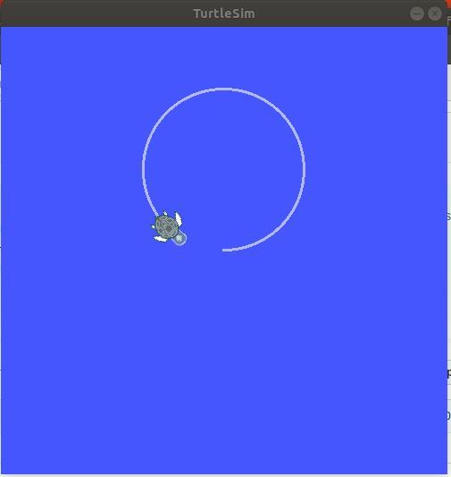

# 古月-ROS入门21讲-Ubuntu20.04-ROS-Noetic版本-Python3代码

### Python代码示例
* Hello World!
```
#! /usr/bin/env python

"""
python version -> helloworld
"""

import rospy

if __name__ == "__main__":
    rospy.init_node('Hello')
    rospy.loginfo("Hello World!")
```
  
### turtlesim

  
### 古月-ROS入门21讲原链接:
[地址](https://github.com/huchunxu/ros_21_tutorials/tree/master)


